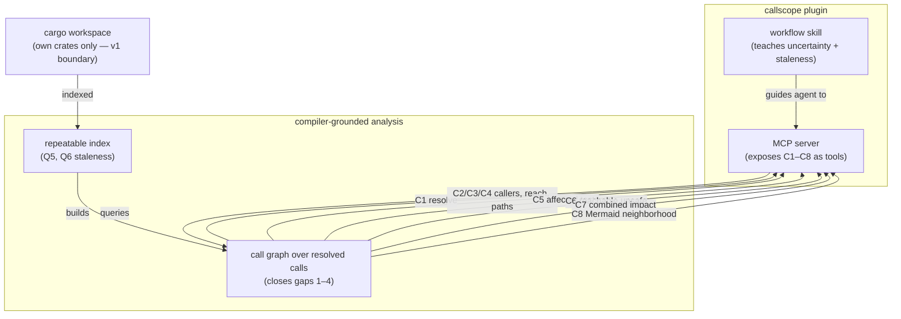

# callscope: compiler-grounded change-impact answers for Rust workspaces

---
**Domain:** code
**Status:** active
**Filed by:** shaper (anticipated-circle mode)
**Active spec/plan:** circles/260726-1815-callscope-rust-change-impact-plugin/planning/260726-1838_c_callscope-implementation.md
**Active session history:** circles/260726-1815-callscope-rust-change-impact-plugin/history/260726-1834-orchestrator-session.md

---

## Directive

A Claude Code plugin named `callscope` — an MCP server plus a workflow skill — exists and lets an AI coding agent get precise change-impact answers about any cargo workspace before it edits Rust code. It answers all eight required questions from the tender: resolve a name to a unique symbol with its characteristics (C1); list direct callers and callees (C2); compute transitive reachability both directions (C3); enumerate call paths between two functions (C4); list the tests that transitively reach a function (C5); list the unsafe code reachable from a function (C6); produce a combined per-function impact answer covering callers and affected tests (C7); and render a call-graph neighborhood as Mermaid text the agent reads inline (C8). Every answer reflects what the Rust compiler actually resolves rather than name matching over source, closing the four source-versus-execution gaps: generic instantiation and monomorphization, trait-object dispatch, closure and async-body attribution, and macro-expanded test harnesses plus erased unsafe. Answers make uncertainty visible: over-approximations (trait-object dispatch above all) and truncations are stated explicitly, ambiguous name lookups return the candidate set rather than a guess, output stays compact and bounded with totals when capped, indexing is repeatable within an editing session, and staleness against the current source state is detectable. Analysis stops at the edge of the user's own workspace crates: call chains that pass through third-party dependency code are out of scope for the first version, and every answer whose completeness that boundary affects says so. The plugin is a real tool for use on arbitrary cargo workspaces; the fixture workspace is the acceptance test, not the target. Done means capabilities C1 through C8 and quality requirements Q1 through Q6 are each demonstrable against that fixture — including the guiding example (changing `parser::normalize_token` to return `Result`), whose affected-tests answer must include the test that reaches the function only through generic trait dispatch and a test from a separate crate's integration-test target.

## Grounding snapshot

**Source.** The full requirements are in `problem.md` at the project root — a tender titled "callscope: Precise Change-Impact Answers for Rust Workspaces". It defines the deliverable (a Claude Code plugin), the problem (source-level tools cannot see what executes), the eight capabilities (section 3, C1–C8), the six quality requirements (section 5, Q1–Q6), the acceptance sketch (section 6), and the one scope boundary the implementer may draw (section 7).

**Workbench state.** New project. Empty workbench at capture time — no prior Circles, no decisions, no issues to cite or reuse. `problem.md` is the only pre-existing input.

**The four language-specific gaps** the tool must close (tender section 2), each a place where source text and executed code diverge in Rust:

1. Generics and monomorphization — one call in source, one per instantiation in the compiled program; a test calling `run_generic(&Simple, ...)` reaches `Simple`'s method and everything behind it without naming it.
2. Trait objects (`dyn Trait`) — dispatched at run time; the honest static answer is "any implementor", and computing that set workspace-wide is beyond text search.
3. Closures and `async fn` — the compiler lowers these into separate anonymous functions; a call inside a closure must be attributed to the enclosing function the user wrote.
4. Macro-expanded test harnesses and erased unsafe — `#[test]` / `#[tokio::test]` expand into generated items whose names collide with user functions, and `unsafe {}` is a source marker with no direct compiled counterpart.

**Decisions taken during clarification** (four questions, user chose the recommended default on each):

- **Third-party dependency boundary (drawn).** v1 analysis stops at the edge of the user's own workspace crates. Any answer whose completeness this affects must state the boundary explicitly. Ties to Q2 (visible uncertainty) and tender section 7.
- **Capability scope (one Circle, all of it).** A single Circle covers C1–C8. Definition of done: C1–C8 and Q1–Q6 all demonstrable against the fixture workspace (tender section 6).
- **Visualization form for C8 (Mermaid text).** The call-graph neighborhood is emitted as Mermaid text the agent reads inline and renders in Markdown — no external rendering tool.
- **Intended use (real tool).** callscope is meant for arbitrary cargo workspaces; the fixture is only the acceptance test.

**Capability shape** (what the plugin exposes and how the pieces relate):

**Open for the planner (technical, not shaped here).** Analysis technique, toolchain requirements, internal architecture, data/index formats, and indexing strategy are all the implementer's choice per tender section 7. The planner determines how the compiler-grounded resolution is obtained and how the index is built and kept re-runnable.

## Dependencies

(none)

## Turn log

- Turn 1 (session 260726-1834): commits b602191..44051d5 (P1 scaffold, P2 schema+Envelope, P10 fixture, P3 fingerprint, P5 query engine, P6 Mermaid renderer); Coherence verdict review-needed — Turn-1 coderev filed CR1 call_paths issues, symbolid-collision, and mermaid-v11 items; session history: circles/260726-1815-callscope-rust-change-impact-plugin/history/260726-1834-orchestrator-session.md
- Turn 2 (session 260726-1834): commits dbf0f50..ec14c5b (CR1 call_paths fix, P8 skill, P9 plugin packaging, P7 MCP server, P4 rustc-driver indexer); decision 260726-2108 on-disk-format → _i_; Coherence verdict review-needed → Rebalance:Artifact — Turn-2 coderev flagged two silent dyn under-approximation gaps (generic + cross-crate implementors); resolution: fix dyn before acceptance; session history: circles/260726-1815-callscope-rust-change-impact-plugin/history/260726-1834-orchestrator-session.md
- Turn 3 (session 260726-1834): commits ea1eae1..01fcf60 (FIX-DYN — dyn over-approximation now spans generic + cross-crate implementors; P11 acceptance harness); Coherence verdict coherent — acceptance harness 19/19 green (re-run at reconciliation 260726-2316), both dyn gaps closed, definition of done met; session history: circles/260726-1815-callscope-rust-change-impact-plugin/history/260726-1834-orchestrator-session.md

_Reconciliation 260726-2316 note: plan 11/11 [DONE] verified; plan → _c_; decisions 260726-1838, 260726-1914, 260726-2253 advanced _a_ → _i_. Circle record marker left _t_ pending the orchestrator's Phase-4 _t_ → _c_ transition (Coherence verdict coherent — see the session history's ## Coherence section)._

## Activation proposal

**Proposed by:** playmaker session 260726-1830 (domain bias: code)
**Proposed activation:** 260726-1830

Recommended as the next Circle to activate. It is the only anticipated Circle in the portfolio, it lists no dependencies, and its Grounding snapshot cites no unresolved open decisions — the four clarification questions were already settled during shaping (the user took the recommended default on each). Nothing blocks a clean start: the requirements source (`problem.md` at the project root) is on disk, the capability set C1–C8 and quality requirements Q1–Q6 are enumerated, and the one scope boundary (analysis stops at the edge of the user's own workspace crates) is drawn. The natural next step is a planning pass that turns the Directive into an implementation plan, since the analysis technique, toolchain, index format, and internal architecture are all left open for the planner.

To activate, run `/fusion:next` and confirm, or `/fusion:next 260726-1815-callscope-rust-change-impact-plugin`. Activation renames this record to active (`_t_`) and writes the `.active-circle` pointer — playmaker does neither.

## Closure note

**Closed coherent (`_c_`)** at 260726-2316 by the orchestrator (session 260726-1834), Phase 4.

The three-edge Coherence verdict was **coherent** — see the `## Coherence` section of `circles/260726-1815-callscope-rust-change-impact-plugin/history/260726-1834-orchestrator-session.md`. Definition of done met: capabilities C1–C8 and quality requirements Q1–Q6 are demonstrable against the fixture, including the guiding example (`affected_tests(parser::normalize_token)` includes both the generic-trait-dispatch test and the separate-crate integration test). Acceptance harness 19/19 green, re-verified at reconciliation.

Delivered over 3 Turns, 13 commits (`b602191..01fcf60`): the three-crate callscope workspace (core + nightly rustc-driver index + stable MCP server), the workflow skill, the Claude Code plugin packaging, and the acceptance fixture. One mid-session Rebalance (Turn 2, Revise Artifact) closed two silent dyn-dispatch under-approximations before closure.

**Known v1 follow-ups (open, non-blocking):** 4 Low issues (FNV duplication, mermaid v11 render-lint, mcp Serialize-mirror dedup, staleness rehash-all) and 2 open design decisions (boundary-flag fires on std calls; MCP server no-index startup UX), plus the documented generic-implementor single-polymorphic-node over-approximation residual (decision 260726-2253, implemented).
