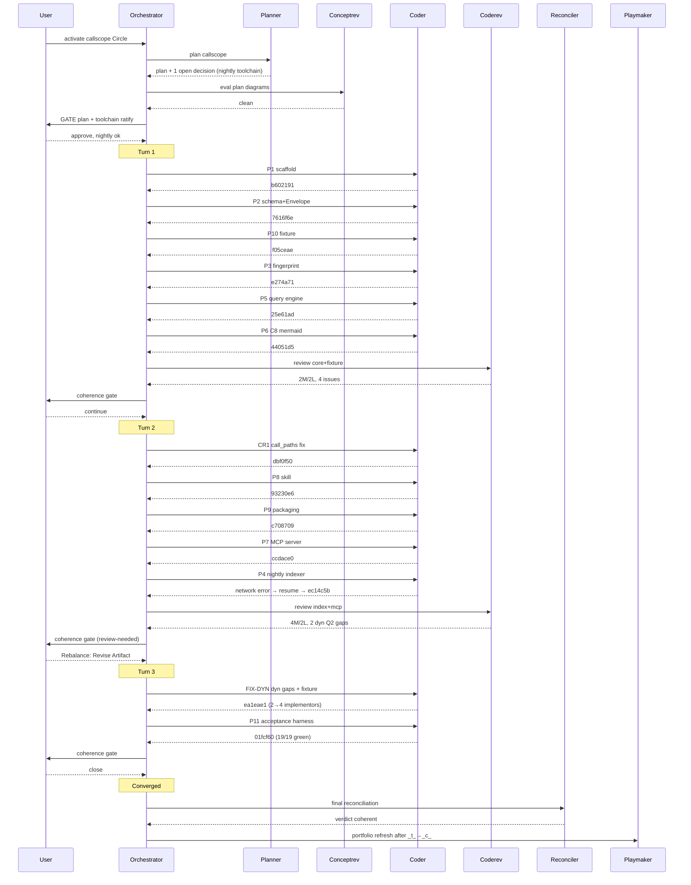

# Orchestrator Session — 260726-1834

**Directive:** Build `callscope` — a Claude Code plugin (MCP server + workflow skill) that gives an AI coding agent compiler-grounded change-impact answers about a Rust cargo workspace. All eight capabilities (C1–C8) and six quality requirements (Q1–Q6) demonstrable against a fixture workspace. Source: `problem.md`. Four shaping decisions baked in: dependency boundary drawn (own crates only), single Circle for all capabilities, Mermaid visualization for C8, real tool (fixture is acceptance test only).
**Mode:** custom (execute active Circle Directive) — planning required (Phase 0b)
**Circle:** circles/260726-1815-callscope-rust-change-impact-plugin
**Status:** Complete — Circle closed coherent (_c_), 11/11 tasks, acceptance 19/19

## Setup Snapshot (Circle-scoped session)

- Paths now resolve into the active Circle (OUT_HISTORY/OUT_ISSUE/OUT_DECISION → Circle stores).
- No interrupted session (`agentstate.yaml` absent).
- Git: not a git repository yet. First commit will initialize once code lands (planning first).
- Guard OK (haltActive false).
- Domain: code.

## Plan

- Shaping already complete: the Circle record `_t_circle.md` is the spec-equivalent (Directive + Grounding snapshot + four decisions).
- Next: dispatch planner to design the implementation approach (analysis technique, toolchain, index format left open by tender §7). Human gate on the plan before execution.

## Coherence
<!-- RECONCILER-OWNED -->

**Verdict:** coherent

**Edges:**
- Artifact↔Grounding: 11/11 plan steps verified on disk / 0 drift items / 4 open coderev issues (all Low: fnv1a dup, mermaid-v11 render check, mcp mirror structs, staleness hash-all) + 2 open design decisions (boundary-std semantics, mcp no-index startup) — all post-v1, none blocking. Acceptance harness 19/19 re-run green at 260726-2316 (fixture 21 symbols/93 edges, deterministic).
- Artifact↔Directive: commits b602191..01fcf60 (13) all move toward the Directive — scaffold → schema/Envelope → fingerprint → query → Mermaid → fixture → rustc-driver indexer → MCP server → skill → plugin → dyn-completeness fix → acceptance; none orthogonal. Definition of done met: C1–C8 + Q1–Q6 demonstrable against the fixture incl. the guiding example (01fcf60 acceptance proof; ec14c5b compiler-grounded indexer closes Q1; ea1eae1 guiding-example dyn completeness — affected_tests(normalize_token) includes both the generic-dispatch and separate-crate integration tests).
- Grounding↔Directive: 4 implemented decisions consistent with the Directive (analysis-technique/toolchain, on-disk-format, staleness-hash-all, generic-implementor-representation) / 0 conflicting. The 2 open decisions (boundary-flag signal quality, no-index server UX) and the generic-implementor single-polymorphic-node residual are documented, sound over-approximation / honest post-v1 follow-ups — not contradictions.

**Rebalance recommendation:** none

## Budget

| Metric | Count |
|--------|-------|
| Turns | 3 |
| Tasks resolved (plan P1–P11) | 11 |
| Extra tasks (CR1 review-fix, FIX-DYN Rebalance) | 2 |
| Tasks skipped/deferred | 0 |
| Issues created (by reviewers) | 8 (2 Turn 1 + 6 Turn 2, incl. decisions) |
| Issues resolved | 4 (call_paths ×2, symbolid-collision, +2 dyn gaps in FIX-DYN = 4 code issues closed; 2 of the "created" are decisions) |
| Decisions answered/implemented | 4 implemented (analysis-technique, on-disk-format, staleness, generic-residual) + 2 open follow-ups |
| Commits | 13 (b602191..01fcf60) |
| Agent errors | 1 (P4 network ENOTFOUND, recovered by resume) |
| Human gates hit | 6 (plan gate + toolchain ratify; 3 per-Turn coherence gates; 1 Rebalance) |

## Per-Turn Log

### Turn 1 — stable core + fixture
- Resolved: P1 scaffold, P2 schema+Envelope, P10 fixture, P3 fingerprint, P5 query engine, P6 C8 mermaid
- Commits: b602191, 7616f6e, f05ceae, e274a71, 25e61ad, 44051d5
- Review: coderev 0C/0H/2M/2L, 4 issues filed
- Coherence: ok

### Turn 2 — indexer + server + skill + packaging
- Resolved: CR1 (call_paths fix), P8 skill, P9 packaging, P7 MCP server, P4 nightly indexer
- Commits: dbf0f50, 93230e6, c708709, ccdace0, ec14c5b
- Note: P4 hit a network error mid-verification; resumed with context and completed (driver + end-to-end index, 4 real bugs fixed)
- Review: coderev 0C/0H/4M/2L, found 2 silent dyn under-approximations (Q2)
- Coherence: review-needed → user chose Rebalance:Artifact

### Turn 3 — dyn fix + acceptance
- Resolved: FIX-DYN (generic + cross-crate dyn implementors, +fixture shapes), P11 acceptance harness
- Commits: ea1eae1, 01fcf60
- FIX-DYN: dyn implementors 2→4, fixed a real panic, generic residual documented
- P11: acceptance 19/19 green (C1–C8 + Q1–Q6, guiding example, enriched dyn coverage)
- Coherence: ok → converged

## Remaining Work (known v1 follow-ups, non-blocking)

Open issues (Low): FNV duplication (schema.rs+fingerprint.rs); mermaid v11 render-lint; mcp Serialize-mirror dedup (core query payloads); staleness rehash-all (mtime-first not built).
Open decisions: boundary_applies fires on std calls (signal-quality); MCP server no-index startup UX.
Documented residual: generic-implementor single-polymorphic-node over-approximation (decision 260726-2253, implemented — honest superset).

## Commits

| Hash | What | Task |
|------|------|------|
| b602191 | scaffold 3-crate workspace + nightly pin | P1 |
| 7616f6e | index schema + Envelope<T> | P2 |
| f05ceae | acceptance fixture (four gaps) | P10 |
| e274a71 | fingerprint + staleness | P3 |
| 25e61ad | graph query engine C1–C7 | P5 |
| 44051d5 | C8 Mermaid renderer | P6 |
| dbf0f50 | call_paths truncation fix | CR1 |
| 93230e6 | workflow skill | P8 |
| c708709 | plugin packaging | P9 |
| ccdace0 | MCP server, 8 tools | P7 |
| ec14c5b | nightly rustc-driver indexer | P4 |
| ea1eae1 | dyn over-approximation generic+cross-crate | FIX-DYN |
| 01fcf60 | acceptance harness C1–C8 + Q1–Q6 | P11 |

## Session Flow

## Portfolio update

Phase 4: playmaker (session 260726-2322) regenerated `portfolio.md` after the `_t_`→`_c_` closure. callscope moved to Recently closed; Active and Anticipated both `(none)`. Portfolio Warnings note the closed Circle's 4 open Low issues + 2 open decisions as non-blocking follow-ups (capture a new Circle to address any). Playmaker history: `shared/history/260726-2322-playmaker-orchestrator-phase4.md`.
