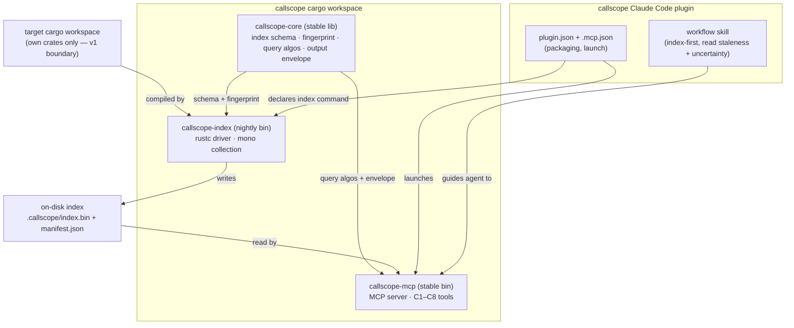
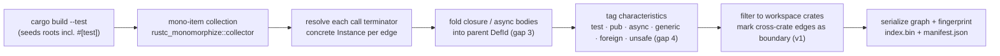

# Implementation Plan: callscope — compiler-grounded change-impact plugin

**Date:** 2026-07-26
**Status:** Complete
**Spec:** Circle record `circles/260726-1815-callscope-rust-change-impact-plugin/_t_circle.md` (spec-equivalent) + tender `problem.md` (authoritative C1–C8, Q1–Q6, §6 acceptance, §7 boundary)

## Directive

Build `callscope`: a Claude Code plugin that lets an AI coding agent get precise change-impact answers about any cargo workspace before it edits Rust. The plugin is an MCP server exposing capabilities C1 through C8 as tools, plus a workflow skill that teaches the agent how to read uncertainty and staleness. Every answer must reflect what the compiler resolves, not name matching, which means closing the four source-versus-execution gaps in `problem.md` §2. Definition of done is C1–C8 and Q1–Q6 all demonstrable against a fixture workspace, including the guiding example (changing `parser::normalize_token` to return `Result`, whose affected-tests answer must include a test reachable only through generic trait dispatch and a test in a separate integration-test crate).

The four settled Circle decisions hold and are not reopened here: the dependency boundary is drawn at the edge of the user's own workspace crates; a single Circle covers all of C1–C8; C8 output is Mermaid text; the tool is real, with the fixture as its acceptance test.

## Current State

New project. The workbench holds only this Circle and its Grounding; there is no prior callscope code, no reusable abstraction, and no adjacent decision to extend. `problem.md` at the project root is the sole pre-existing input. The Research Gate therefore surveys the external ecosystem rather than an internal codebase, and its finding is recorded in the decision record cited below.

The analysis technique is the plan's central open choice, and evidence settles it. The Rust compiler already computes what callscope needs during its monomorphization-collection stage: `rustc_monomorphize::collector` scans MIR for calls, closures, and drop-glue, and on a trait-object cast it instantiates every `dyn`-compatible method of the trait. That single stage closes gap 1 (generic instantiation), gap 2 (the honest `dyn` over-approximation that Q2 asks to make visible), and gap 3 (closure and `async` bodies, collected as items that fold back to their parent function). HIR attributes and the unsafety check close gap 4 (`#[test]` and `unsafe`). The public API for reading this from an external tool is `rustc_public` (formerly `stable_mir`), the Rust project's SemVer-tracked surface for compiler-backed tools, shipped in the nightly `rustc-dev` component. Prior art confirms the path is trodden: `cargo-call-stack`, nrc's `callgraph.rs`, Kani, and MIRAI all drive rustc to build call graphs.

No stable-toolchain technique reaches monomorphized reachability. rust-analyzer resolves a call inside a generic function to the trait method, not to the concrete implementation a caller instantiates, so it cannot close gap 1 without rebuilding the compiler's collector by hand. The technique choice and its one real cost — indexing needs a pinned nightly toolchain — are filed for user ratification in `decisions/260726-1838_o_analysis-technique-and-toolchain.md`.

## Approach

One integral pipeline, split by toolchain need rather than by capability. A single cargo workspace holds three crates. A shared library, `callscope-core`, owns the index schema, the staleness fingerprint, the graph query algorithms, and the one output envelope every tool returns. A nightly rustc-driver binary, `callscope-index`, is the only component that links the compiler: it runs each workspace crate through mono-item collection, builds the resolved call graph, filters it to the user's own crates, folds closure and async bodies back into their enclosing functions, tags each function's characteristics, and writes the index plus a fingerprint manifest to disk. A stable-toolchain binary, `callscope-mcp`, reads that index and serves C1–C8 as MCP tools; it never links the compiler, so the agent-facing half of the tool needs only stable Rust. A workflow skill teaches the agent to index first, to re-index when an answer reports staleness, and to read the over-approximation and boundary flags rather than trust a bare list.

The design deliberately routes every capability through one shared output envelope instead of giving each tool its own ad-hoc flags. Q2 (visible uncertainty), Q4 (bounded output with totals), Q6 (staleness), and the drawn dependency boundary are not per-tool special cases; they are four fields on one struct that every answer carries. That is the unifying move that keeps the tool surface from fragmenting into eight differently-shaped results.

### Component shape

### Indexing pipeline (how ground truth is obtained)

## Implementation Steps

1. **Workspace scaffold and toolchain pin** [DONE]
   - Executor: coder
   - Files: `Cargo.toml` (workspace), `crates/callscope-core/Cargo.toml`, `crates/callscope-index/Cargo.toml`, `crates/callscope-mcp/Cargo.toml`, `rust-toolchain.toml`
   - Changes: Create the three-crate workspace. `callscope-index` pins the nightly toolchain with the `rustc-dev` component via `rust-toolchain.toml`; `callscope-core` and `callscope-mcp` build on stable. Wire `serde` in core, the MCP SDK (`rmcp`) in the server crate.
   - Dependencies: none. Gated on the toolchain decision only insofar as `rust-toolchain.toml` encodes it.

2. [DONE] **Index schema and output envelope in `callscope-core`**
   - Executor: coder
   - Files: `crates/callscope-core/src/schema.rs`, `crates/callscope-core/src/envelope.rs`
   - Changes: Define the serde-serializable graph: symbols (stable id, fully-qualified path, crate, span) with characteristics (test, public, async, generic, foreign, uses-unsafe), and directed call edges tagged `static` or `virtual` (dyn). Define the single `Envelope<T>` every tool returns, carrying `stale`, `over_approximated` (with the reason, e.g. dyn dispatch), `truncated` + `total`, and `boundary_applies`. This struct is the single source of truth for Q2/Q4/Q6/boundary reporting.
   - Dependencies: step 1.

3. [DONE] **Fingerprint and staleness module in `callscope-core`**
   - Executor: coder
   - Files: `crates/callscope-core/src/fingerprint.rs`
   - Changes: Compute a workspace source fingerprint: per-file content hash of every `.rs` in workspace members plus `Cargo.lock` hash plus the toolchain version. Provide a cheap staleness check (stat mtimes first, hash only changed files) that returns which files diverged. One implementation, used by `callscope-index` to write the manifest and by `callscope-mcp` to detect staleness — no second copy. Satisfies Q5 (repeatable) and Q6 (detectable staleness).
   - Dependencies: step 2.

4. [DONE] **`callscope-index` rustc-driver indexing engine** — indexes the fixture workspace end-to-end (16 symbols, 66 edges); all four gaps close and the produced index loads into `callscope-core`/`callscope-mcp` via serde_json and answers C5/C6/Q2 correctly. See history `260726-2145-coder-p4-callscope-index-engine.md`.
   - Executor: coder
   - Files: `crates/callscope-index/src/main.rs`, `crates/callscope-index/src/driver.rs`, `crates/callscope-index/src/graph_build.rs`
   - Changes: Run each workspace crate through mono-item collection in test mode (so `#[test]` roots are seeded, which C5 needs). For each call terminator, resolve the concrete callee instance so a generic call resolves to the instantiated implementation (gap 1); keep `dyn` calls as virtual edges over-approximated to all workspace implementors and record the over-approximation (gap 2, Q2). Fold closure/async/drop-glue bodies into their enclosing user function via the parent chain (gap 3). Tag characteristics from HIR attributes and the unsafety check (gap 4). Filter to workspace-member crates; mark any edge crossing into a third-party crate as a boundary edge so answers can state the boundary (v1 decision, Q2). Write `index.bin` and `manifest.json`.
   - Dependencies: steps 2, 3; approval of `decisions/260726-1838_o_analysis-technique-and-toolchain.md`.

5. [DONE] **Graph query engine in `callscope-core`**
   - Executor: coder
   - Files: `crates/callscope-core/src/query.rs`
   - Changes: Pure functions over a loaded graph: symbol resolution from a name or fragment returning the candidate set (C1, Q3 — never pick one); direct callers/callees (C2); bounded transitive reachability forward and backward (C3); enumerated call paths between two symbols (C4); tests transitively reaching a symbol (C5); unsafe code reachable from a symbol (C6); combined caller-plus-affected-tests impact (C7). Every function returns results wrapped for the envelope: it reports totals and marks truncation when a bound is hit (Q4) and propagates over-approximation and boundary flags encountered along the walk (Q2).
   - Dependencies: step 2.

6. [DONE] **C8 Mermaid neighborhood renderer in `callscope-core`**
   - Executor: coder
   - Files: `crates/callscope-core/src/mermaid.rs`
   - Changes: Render the bounded neighborhood around a symbol as Mermaid `flowchart` text the agent reads inline. Distinguish static from virtual (dyn) edges visually, mark boundary edges, and cap node/edge count with a stated total when capped (Q4). No external renderer (settled decision 3).
   - Dependencies: step 5.

7. [DONE] **`callscope-mcp` MCP server exposing C1–C8**
   - Executor: coder
   - Files: `crates/callscope-mcp/src/main.rs`, `crates/callscope-mcp/src/tools.rs`
   - Changes: A stdio MCP server that loads the index once, runs the staleness check on every request, and exposes eight tools mapping to C1–C8 (`resolve_symbol`, `direct_calls`, `reachability`, `call_paths`, `affected_tests`, `reachable_unsafe`, `impact`, `neighborhood_graph`). Each tool returns the shared envelope; `stale: true` with the diverged files is attached whenever the fingerprint check fails (Q6). Links no compiler internals — stable toolchain only.
   - Dependencies: steps 3, 5, 6.

8. **Workflow skill** [DONE]
   - Executor: coder
   - Files: `skills/callscope/SKILL.md`
   - Changes: Teach the agent the intended sequence for a change-impact question (index, then resolve, then impact, then read the affected tests), how to act on a stale result (re-index before trusting the answer), how to read an over-approximated `dyn`-dispatch answer as "any workspace implementor," and how to read the dependency-boundary note. Ground the guidance in the guiding example.
   - Dependencies: step 7.

9. **Plugin packaging** [DONE]
   - Executor: coder
   - Files: `.claude-plugin/plugin.json`, `.mcp.json`, `README.md`
   - Changes: Declare the Claude Code plugin: metadata, the bundled skill, and the MCP server launch (`callscope-mcp`). Document the one-time indexing command (`callscope-index`) and the nightly-toolchain prerequisite honestly, including that only indexing needs nightly. Plugin packaging is assigned to coder by the executor routing.
   - Dependencies: steps 7, 8.

10. **Fixture workspace** [DONE]
    - Executor: coder
    - Files: `fixtures/workspace/**` (a `parser` lib crate with `normalize_token`, a `Tokenizer` trait, `run_generic<T: Tokenizer>`, `Simple` and `Fancy` implementors, a `&dyn Tokenizer` use site, a closure `.map(|t| normalize_token(t))`, an `async fn`, a reachable `unsafe {}` block, unit `#[test]` and `#[tokio::test]`; plus a separate integration-test crate/target reaching `normalize_token` only through generic trait dispatch)
    - Changes: Build the fixture to exercise every construct §6 enumerates and to make the guiding example answerable. The separate-crate integration test and the generic-trait-dispatch test are the two answers the acceptance check keys on.
    - Dependencies: none (can proceed in parallel with 1–9).

11. [DONE] **Acceptance harness: C1–C8 and Q1–Q6 against the fixture** — `crates/callscope-mcp/tests/acceptance.rs` runs the real `callscope-index` binary against `fixtures/workspace/`, loads the produced `index.bin` through the `callscope-mcp` handler layer, and asserts 19 checks (C1–C8, the four-implementor dyn coverage, Q1's four gaps, Q2–Q6, and boundary). All 19 pass; the load-bearing §6 answer holds (affected_tests(normalize_token) includes both the in-crate generic-dispatch test and the separate-crate integration test). No production behavior changed. See history `260726-2306-coder-p11-acceptance-harness.md`.
    - Executor: coder
    - Files: `crates/callscope-mcp/tests/acceptance.rs` (or a top-level `tests/` harness)
    - Changes: Index the fixture, then assert each capability and each quality requirement. The load-bearing assertion: the affected-tests answer for `parser::normalize_token` includes both the generic-trait-dispatch test and the separate-crate integration test (§6, Q1). Assert Q2 (a `dyn` answer is flagged over-approximate), Q3 (an ambiguous name returns candidates), Q4 (a capped list reports its total), Q6 (editing a fixture file flips `stale` to true).
    - Dependencies: steps 4, 7, 10.

## Data Structures

- `Symbol { id, fq_path, crate_name, span, characteristics }` where `characteristics = { test, public, async, generic, foreign, uses_unsafe }` (C1).
- `Edge { from: SymbolId, to: SymbolId, kind: Static | Virtual }` — `Virtual` marks a `dyn`-dispatch edge, which is where over-approximation originates (Q2).
- `Index { symbols, edges, schema_version }` serialized to `index.bin`.
- `Manifest { schema_version, toolchain, file_hashes, cargo_lock_hash, indexed_at }` in `manifest.json` (Q5/Q6).
- `Envelope<T> { data: T, stale: Option<StaleInfo>, over_approximated: Option<Reason>, truncated: bool, total: usize, boundary_applies: bool }` — the one shape every tool returns (Q2/Q4/Q6/boundary).

## API Changes

New MCP tool surface (the plugin's public interface), each returning `Envelope<T>`:

| Tool | Capability | Input | Output core |
|------|-----------|-------|-------------|
| `resolve_symbol` | C1 | name or fragment | candidate symbols + characteristics |
| `direct_calls` | C2 | symbol | callers, callees |
| `reachability` | C3 | symbol, direction | transitive set |
| `call_paths` | C4 | from, to | enumerated paths |
| `affected_tests` | C5 | symbol | reaching tests |
| `reachable_unsafe` | C6 | symbol | reachable unsafe sites |
| `impact` | C7 | symbol | callers + affected tests |
| `neighborhood_graph` | C8 | symbol, depth | Mermaid text |

Plus one CLI surface: `callscope-index <workspace>` builds or refreshes the index.

## Testing Strategy

The fixture workspace (step 10) is the acceptance substrate mandated by §6. The acceptance harness (step 11) drives the built index and asserts every capability and quality requirement against it, with the guiding-example affected-tests result as the primary gate. Unit tests cover the pure query algorithms in `callscope-core` (reachability bounds, path enumeration, candidate-set resolution) on small hand-built graphs, independent of the nightly driver, so most of the logic is testable on stable. The driver itself is validated end-to-end through the fixture rather than in isolation, because its output only has meaning against real compiled code.

## Risks & Mitigations

| Risk | Mitigation |
|------|-----------|
| Nightly `rustc_public`/internal API drifts on toolchain bump, breaking `callscope-index`. | Pin the toolchain in `rust-toolchain.toml`; isolate all compiler-linked code in `callscope-index` so drift never touches core or the server; record the exact working toolchain in the manifest. |
| User rejects the nightly requirement. | Decision record `260726-1838` surfaces the trade-off for ratification before step 4; if rejected, Q1 is unmeetable on stable and the Circle scope must be renegotiated. Flagged, not guessed. |
| `dyn`-dispatch over-approximation is read as exact by the agent. | The `Virtual` edge kind forces the `over_approximated` flag onto every affected answer, and the skill teaches the agent to read it as "any workspace implementor" (Q2). |
| Mono collection needs program roots; a pure-library workspace has none. | Index in test mode so `#[test]` items seed roots; document that items unreachable from any root are absent by design (this is a "what executes" tool, not a name index). |
| Re-index cost too high for an editing session (Q5). | Drive indexing through cargo so incremental MIR building is cached; the mtime-first fingerprint avoids rehashing unchanged files. |
| Closure/async attribution mis-parents a call. | Fold via the compiler's own parent chain rather than heuristics; assert attribution in the acceptance harness through the fixture's `.map(|t| normalize_token(t))` closure. |

## Open Questions

- [ ] Ratify the analysis technique and its nightly-toolchain cost — `decisions/260726-1838_o_analysis-technique-and-toolchain.md`. Blocks step 4 (the indexing engine); steps 1–3, 5, 6, 10 and the stable-side design proceed regardless.

## Executor routing note

Every step routes to **coder**: the deliverable is Rust code, a workflow skill, and plugin packaging, all of which the executor routing assigns to coder. **ontocoder has no step in v1.** There is no hand-authored structured data to own — `manifest.json` is generated by `callscope-index`, and authoring a separate JSON schema for it would duplicate the `callscope-core` serde types and drift from them, so it is deliberately not planned. If a published index schema is wanted later, generate it from the Rust types rather than hand-maintaining a second copy.

## Reconciliation Log

**260726-2316 — final reconciliation (Phase 3), domain=code.** All 11 steps verified `[DONE]` against ground truth; plan Status → Complete, filename marker `_p_` → `_c_`.

- **Empirical acceptance run (not trusted from history):** rebuilt `callscope-index` on the pinned nightly and ran `cargo test -p callscope-mcp --test acceptance` — **19/19 checks passed** (C1–C8, DYN four-implementor coverage, Q1×4, Q2–Q6, BND), test `ok` in 7.26s. Fixture index 21 symbols / 93 edges, byte-deterministic across two runs. The load-bearing §6 answer holds: `affected_tests(parser::normalize_token)` includes both the in-crate generic-dispatch test (`reaches_via_generic_dispatch`) and the separate-crate integration test (`integration_reaches_via_generic`).
- **Files verified on disk:** three-crate workspace (`crates/callscope-{core,index,mcp}`), `rust-toolchain.toml` pinning `nightly-2026-07-26` + `rustc-dev`, `skills/callscope/SKILL.md`, `.claude-plugin/plugin.json`, `.mcp.json`, `README.md`, fixture `fixtures/workspace/**` (parser + ext_tokenizer members + integration test). Git: 13 commits `b602191..01fcf60`, working tree clean.
- **Step-to-commit map:** P1 `b602191`, P2 `7616f6e`, P10 `f05ceae`, P3 `e274a71`, P5 `25e61ad`, P6 `44051d5` (Turn 1); CR1 `dbf0f50`, P8 `93230e6`, P9 `c708709`, P7 `ccdace0`, P4 `ec14c5b` (Turn 2); FIX-DYN `ea1eae1`, P11 `01fcf60` (Turn 3).
- **No drift:** built code matches the plan's Approach and Data Structures (single `Envelope<T>` carries `stale`/`over_approximated`/`truncated`+`total`/`boundary_applies`; three-crate split by toolchain need; serde_json on-disk format).
- **Open follow-ups (do not block closure):** 4 Low-severity `_o_` issues (fnv1a duplication, mermaid-v11 render verification, mcp mirror-struct duplication, staleness hash-all-per-request) + 2 `_o_` design decisions (boundary-flag std semantics, mcp no-index startup). All are honest, documented post-v1 items — see the reconciliation history `history/260726-2316-reconciliation.md`.
- The one plan Open Question (ratify analysis technique + nightly cost) is settled and realised: decision `260726-1838` advanced `_a_` → `_i_`.
